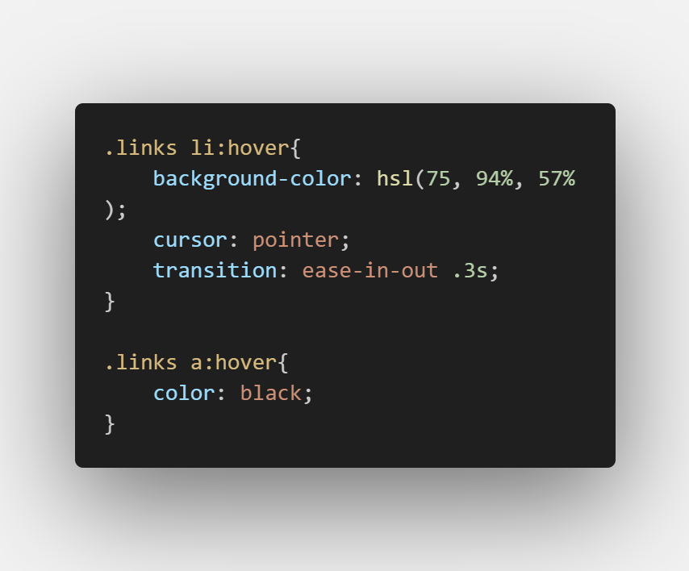

# Frontend Mentor - Social links profile solution

This is a solution to the [Social links profile challenge on Frontend Mentor](https://www.frontendmentor.io/challenges/social-links-profile-UG32l9m6dQ). Frontend Mentor challenges help you improve your coding skills by building realistic projects. 

## Table of contents

- [Overview](#overview)
  - [The challenge](#the-challenge)
  - [Screenshot](#screenshot)
  - [Links](#links)
- [My process](#my-process)
  - [Built with](#built-with)
  - [What I learned](#what-i-learned)
  - [Continued development](#continued-development)
  - [Useful resources](#useful-resources)
- [Author](#author)


## Overview

### The challenge

Users should be able to:

- See hover and focus states for all interactive elements on the page

### Screenshot




### Links

- Solution URL: [Add solution URL here](https://your-solution-url.com)
- Live Site URL: [Add live site URL here](https://your-live-site-url.com)

## My process

### Built with

- HTML5 markup
- CSS custom properties
- Absolute Positioning
- Media Query
- Typeface


### What I learned
Absolute Positioning
```css
.container{
  position: absolute;
  top: 50%;
  left: 50%;
  transform: translate(-50%, -50%);
}
```

### Continued development
- Positioning
- Responsiveness

### Useful resources

- [ChatGPT](https://chat.openai.com/share/ce587b69-972f-4f44-8e1f-5cda441a3c47) - This helped me for Absolute Positioning. I really liked this pattern and will use it going forward.


## Author

- Frontend Mentor - [Isaac-Victor Providence](https://www.frontendmentor.io/profile/Emoji123-s)
- Twitter - [Divine Providence](https://twitter.com/p_r_o_v_i_dence)
- Github - [Isaac-Victor Providence](https://github.com/Emoji123-s)